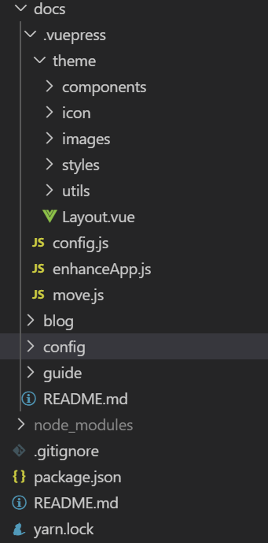
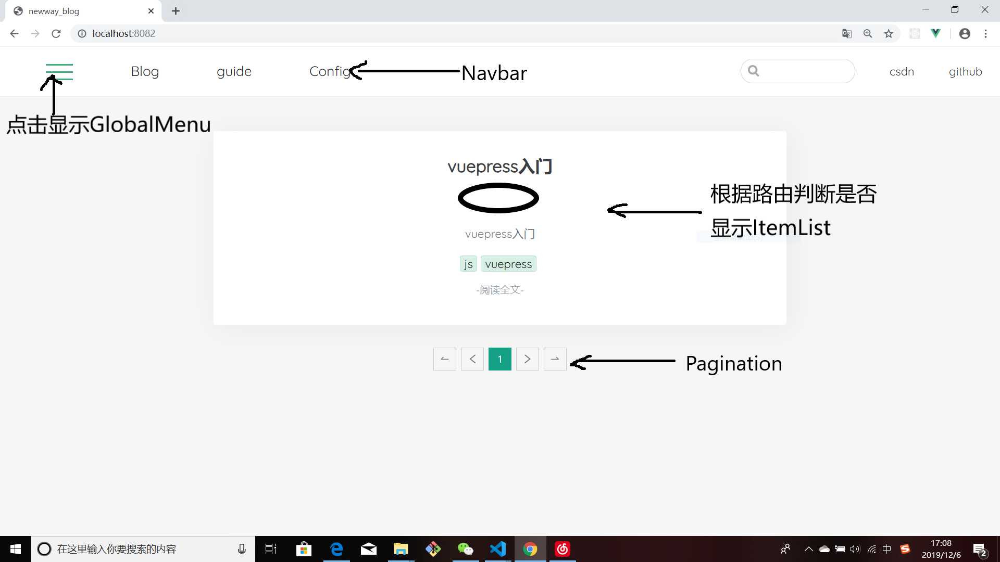

<!-- more -->


# VuePress从零开始搭建博客

花了2天多的时间总算搭出一个博客的雏形了。
搭建的博客没有使用官方提供的**主题**，而是自己创建了一个主题。所以，在样式上，有自己的风格和特点。

转入正题。

## 环境搭建

安装VuePress
```
yarn global add vuepress 
或者：npm install -g vuepress
也可以直接下载我的代码。然后cnpm i 下载依赖
```
**注**：个人建议，更推荐使用 npm或者cnpm安装vuepress，我尝试过使用yarn，但是安装过程中经常会报错error。也可以本地安装，看你个人偏好。

## 配置

以下是我的文件夹的目录：
docs文件夹下面有：
- .vuepress
- blog
- config
- guide
- README.md


这几个文件或者文件夹。




.vuepress是静态网站的生成器。你写的md文档都要通过它来表现出来。

## 自定义主题

**theme**是一个自定义的主题。里面包含了你的网站的样式，图片和vue组件等等。

主要讲一讲components文件夹里面的组件。

components中的组件最终都被Layout.vue引用。（默认使用Layout.vue作为vuepress的主入口。）
首页页面显示如图所示：


具体详情请查看代码。

**config.js**是你的配置文件。一个config.js的主要配置包括网站的标题、描述、导航栏的设置等基本信息，以及主题的配置。

以我的config为例：

```
module.exports = {
  title:'newway_blog',//网站的titile
  base: '/test_1/',//基本路径
  themeConfig: {
    nav: [
      { 
        text: 'Blog', 
        link: '/' ,
      },//导航栏配置，此配置主要用于配置导航栏的链接

      {
        text: 'guide',
        link: '/guide/',//这是路由，点击guide默认显示guide/README.md中的内容
      },
      {
        text: 'Config',
        link: '/config/'
      },
    ]
    
  },
  chainWebpack: (config) => {//webpack的配置；
    config.module.rule('js')
      .exclude.add(/(docs\/.vuepress\/theme\/icon\/*.js)/).end()
  },

}
```

**踩过的一个坑**：每次修改config.js都要重启一下服务器，不然，会报错。(如果报错，你又找不到问题所在，重启服务器就好了。)


如果你想要一个更加炫酷的多功能的blog，比如有侧边栏，有上一篇和下一篇的链接，有回到顶部等等功能，可以选择如下方式。

```
npm install @vuepress/theme-default@next

##复制node_modules/@vuepress/theme-default 文件夹
##粘贴至.vuepress/ 下并更名为theme
## 你就可以做出更加丰富的效果以及自定义你的主题方式。
```


如果想看一下你blog的效果，
可以在package.json中配置：
```
  "scripts": {
    "start": "vuepress dev docs",//打开浏览器，本地看你的博客效果
    "build": "vuepress build docs",//打包你的文件
    "deploy": "bash deploy.sh"//在你的根目录下打开git bash 运行npm run deploy(修改成你的github路径)
  },
```
至于markdown语法。网上一堆的教程，这里只是重点讲一些该博客的食用方式，就不拾人牙慧了。
